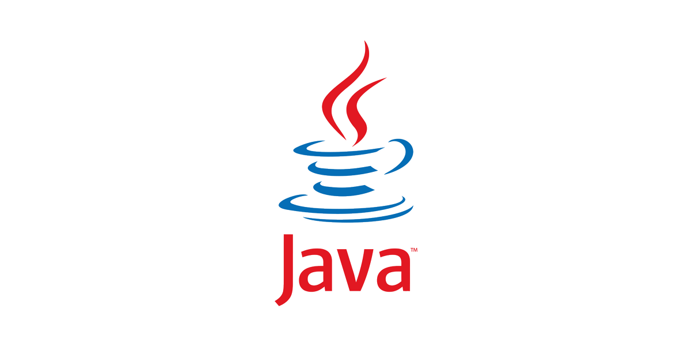
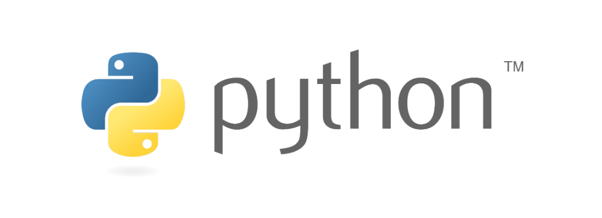
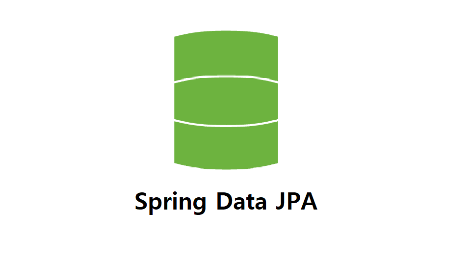
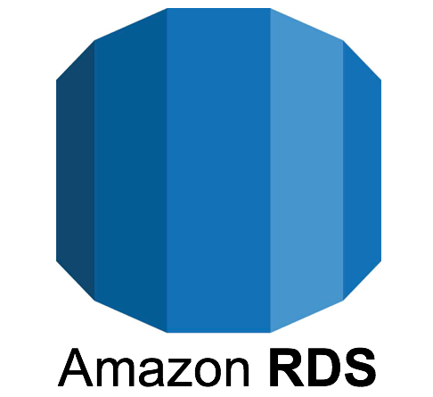
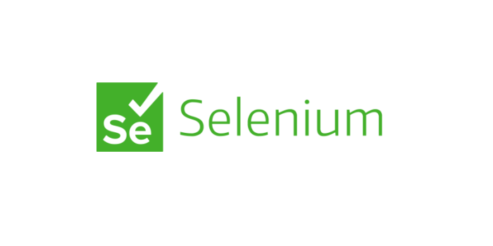
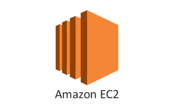

# Graduation_Project

# Deployment in Progress!

### Visit our website to check this project!
[<h3 style="border-bottom: none">cardvisor.ga</h3>](http://cardvisor.ga)
   

# Frontend Repository
[<h3 style="border-bottom: none">https://github.com/NeckyKim/cardvisor</h3>](https://github.com/NeckyKim/cardvisor)
  

# Backend Team Members

#### Name &nbsp; | &nbsp; Minseok Kim
#### Major &nbsp; | &nbsp; Hongik University Chemical Engineering / Computer Engineering
#### Team &nbsp; | &nbsp; Cardvisor
#### Position &nbsp; | &nbsp; Backend Engineer / Data analysis
  

#### Name &nbsp; | &nbsp; Yung Cho
#### Major &nbsp; | &nbsp; Hongik University Computer Engineering
#### Team &nbsp; | &nbsp; Cardvisor
#### Position &nbsp; | &nbsp; Backend Engineer / Data analysis
   

# Technologies and Software Used

#### BackEnd Programming Languages

 

 

#### BackEnd Framework

###### API Server

 

###### Recommendation Server

 

#### Data Analysis

 

 

#### Data Analysis

  

 

#### Deployment

 

#### Version Control

&nbsp;&nbsp;&nbsp;&nbsp;&nbsp;&nbsp;&nbsp;&nbsp;&nbsp;&nbsp;&nbsp;&nbsp;

   
   

# Version Logs

**[readme in progress(20221006)](https://github.com/min-0404/Graduation_Project/commit/d259f06231e5b80200f615a31e5a165e0dee623e)**

**[first try in fixing httpOnly cookie(20220926)](https://github.com/min-0404/Graduation_Project/commit/f1e43d100eaabee5ebd0f4939f0b5e379c2444df)**

**[changine gitignore(20220925)](https://github.com/min-0404/Graduation_Project/commit/742491231a4ccd36eaa5e3d0e5ca6ee2b81c20f2)**

**[making changes to gitignore (20220925)](https://github.com/min-0404/Graduation_Project/commit/d8b304e5d06d24cb6feb437842c2f48064b65dbd)**

**[adding new methods to python code (20220923)](https://github.com/min-0404/Graduation_Project/commit/81d8f6afb496fcefac8bb48d1bea23094416eab5)**

**[changing rds endpoint (20220923)](https://github.com/min-0404/Graduation_Project/commit/a247d44f808015f32c8fb0e5c6e4a264a6e25f0d)**

**[changing servicetwo.cost datatype from int to float](https://github.com/min-0404/Graduation_Project/commit/83bbf1f0b5ddbb1a6bd9debd6c2af2837264c25d)**

**[jwt implementation completed on the freshly refactored code](https://github.com/min-0404/Graduation_Project/commit/24429f0a893678ff584499f330db8cc692f48d59)**

**[revised code structure(20220912)](https://github.com/min-0404/Graduation_Project/commit/594a96dc055c91f56aa233a5b76aae2c3c5c37f1)**

**[fixed Refresh Error (20220812)](https://github.com/min-0404/Graduation_Project/commit/f33e24b4ad742c21a5fa4a6c133e0dd7de541f3f)**

**[created DtoService, cleaned ServiceLayer(20220809)](https://github.com/min-0404/Graduation_Project/commit/85aec90271a1f57e90c8dde2a28a95e93e5e0beb)**

**[Brand Names in Korean added to ServiceOne Results (220617)](https://github.com/min-0404/Graduation_Project/commit/839d1e1199616b1f6448dbf6fcde3c1a2c834e1e)**

**[semester final](https://github.com/min-0404/Graduation_Project/commit/2aff2d4f18a7640a8695921fda53821cc027d6f0)(20220616)**

**[flask + english name brand](https://github.com/min-0404/Graduation_Project/commit/14da986453c89b5e6d03cd67584d8476c2cdef78)(20220616)**

// 여기서부터 주작 필요

20220614: Adding comments to the code for better comprehension of the service one logic

20220611: Fixing “service one” page refresh error (first try)

20220601: Adding comments to the code for better comprehension

20220531: implementing Server to Server communication between the Spring and Flask servers

20220520: new API functions on the Benefit controller class for the first recommendation service

20220513: Messenger class (DTO) for Server to Server communication

20220512: Individual card info API completed + Adding new Repository functions for future logics

20220510:  **[Delete src/main/java/Graduation/CardVisor/Repository directory](https://github.com/min-0404/Graduation_Project/commit/09f7a495a4879452da97cc1d1fed9a394288ecfa)**

20220509: Functions for the controller to complete the cardinfo API

20220429: Making of the logic functions for Individual card info pages

20220428: Adding repository interfaces following the ERD structure

20220427: Adding domain classes following the ERD structure

### Ver. 1.0.0 (2022/04/09)
First Commit of the Cardvisor Backend Project

